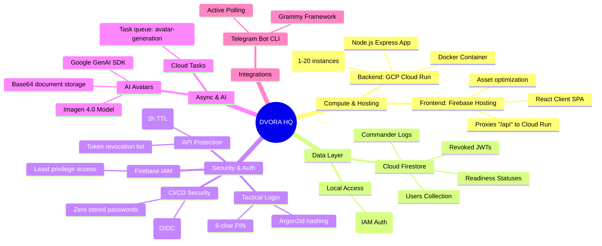

# Dvora HQ Architecture Mindmap

Here is the structured mindmap of the Dvora HQ tactical system architecture. It shows how the compute services, data layer, security protocols, AI avatar generator, and Telegram CLI bot integrate together.

## Interactive Mindmap

## Architecture Breakdown

### 1. Compute & Hosting

- **GCP Cloud Run**: Hosts the production Node.js Express backend. It's configured to scale automatically based on request load, with a minimum of 1 instance to prevent cold starts during Telegram webhook requests or user interactions.
- **Firebase Hosting**: Serves the static React SPA frontend. A routing proxy redirects all traffic under `/api/**` and `/health` directly to the Cloud Run backend, eliminating CORS issues and keeping the application under a single domain.

### 2. Data Layer

- **Cloud Firestore**: A fully serverless, NoSQL document store that manages all tactical state. User profiles are stored in the `users` collection using their unique 6-character PIN code as the document ID for O(1) direct lookups. Other collections include `readiness_status`, `commander_reports`, and `revoked_tokens`.
- **Local Access**: Developers connect securely to the live database using standard Application Default Credentials (ADC) without requiring a database proxy.

### 3. Security & Auth

- **Tactical PIN**: Authorized operators log in using a 6-character tactical PIN (5 digits + 1 letter) which is hashed with Argon2id on the backend.
- **JWT & Revocation**: Authenticated sessions issue a JSON Web Token (JWT) with a 2-hour TTL. Revocation is handled via a database deny-list for maximum security.
- **OIDC WIF**: GitHub Actions logs into Google Cloud securely via OIDC token exchange (Workload Identity Federation), avoiding the need to store long-lived JSON service account keys in the repository secrets.

### 4. Async & AI

- **Imagen 4.0**: Generates tactical cyberpunk avatars based on the weapons and specializations selected by operators during onboarding.
- **Cloud Tasks**: Manages background queue operations for avatar rendering and retry logic.
